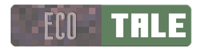

# EcoTale

Inspired by Klei_Wright's [Why Mojang Struggles to design Ecologies](https://youtu.be/f21YJ5pjPog), EcoTale reimagines Minecraft's ecology, inviting players to cultivate living ecosystems where intuitive, humane choices unlock the richest rewards. Minecraft's creatures have been transformed into dynamic partners with their own behaviors, needs, and gifts for those who tend to them thoughtfully.

## Vision

<!-- TODO: Expanded vision statement describing the mod's goals and inspiration -->

## Current Features
**This mod is in early alpha. All features are subject to change and iteration.**

<!-- TODO: Feature summary -->

### Getting Started
<!-- TODO: Quick start guide -->

## Requirements
- **Minecraft:** 1.20.1
- **NeoForge:** 47.1.100 or higher, or **Forge:** 47.4.10 or higher

## Development

Track what's coming in the [roadmap](ROADMAP.md), see what's changed in the [changelog](CHANGELOG.md), or follow current work on our [project board](https://github.com/orgs/SoSly/projects/<!-- TODO: project number -->).

## License

MIT—See [LICENSE](LICENSE) for details
