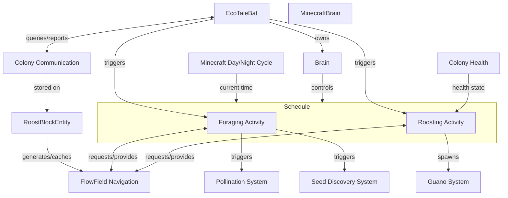

The AI Behavior system controls what individual bats do. It serves the Bats feature concept by making bats feel alive—foraging at night, roosting by day, visiting farms, and responding visibly to colony stress.

Bats are autonomous actors. They make decisions based on time of day, colony health state, and learned knowledge about their environment. Players observe bat behavior to understand colony health; they don't directly control bats.

## System Diagram



## Subsystems

AI Behavior decomposes into these subsystems, each requiring further specification:

| Subsystem             | What It Does                                           | Key Concerns                                                |
| --------------------- | ------------------------------------------------------ | ----------------------------------------------------------- |
| Minecraft Brain       | Controls schedules and AI goals                        | Sensors, Memories, and Behaviors                            |
| Flow Field Navigation | Guides bats through caves using precomputed paths      | Generation threading, solution caching, exit identification |
| Foraging Activity     | Controls what bats do outside the cave                 | Farm detection, pollination triggers, wander patterns       |
| Roosting Activity     | Controls what bats do at the roost                     | Return navigation, rest states, stress responses            |
| Colony Communication  | Shares discovered resource locations among colony bats | Knowledge storage, discovery reporting, query interface     |

### Minecraft Brain

Minecraft's Brain system organizes entity AI into sensors (perception), memories (state), activities (modes), and behaviors (actions). EcoTaleBat uses this vanilla system rather than the older Goal-based AI.

**How we use it:**

- **Activities:** Two activities (ROOST, FORAGE) control which behaviors are available
- **Sensors:** Detect time of day, nearby blocks, colony health state
- **Memories:** Store HOME position, IS_OUTSIDE state, current targets
- **Behaviors:** Implement specific actions (ExitCave, ReturnToRoost, Wander, VisitFarm, etc.)

**Schedule configuration:** A Schedule maps time-of-day ranges to activities. The brain automatically switches activities based on game time—no custom tick logic needed.

**Open parameters:** Exact tick values for activity transitions (dusk, pre-dawn).

### Flow Field Navigation

Responsible for guiding bats through cave systems using precomputed directional data.

**Must support:**

- Generating outward flow field (roost → exit) for leaving the cave
- Generating inward flow field (exit → roost) for returning home
- Identifying cave exits and elevated entrance points above terrain
- Running generation off the main thread to avoid lag
- Caching solutions for bat queries
- Periodic revalidation to detect geometry changes
- Sharing solutions between nearby roosts with overlapping territory

**Open parameters:** Flow field resolution, search bounds, generation queue behavior, revalidation frequency, solution sharing criteria.

### Foraging Activity

Responsible for bat actions outside the cave during FORAGE activity.

**Must support:**

- Exiting the cave via flow field navigation
- Wandering randomly with obstacle avoidance
- Detecting nearby farms within foraging range
- Visiting farms to trigger pollination
- Occasionally triggering seed discovery on empty farmland

**Open parameters:** Wander radius, farm detection range, pollination chance, seed discovery chance.

### Roosting Activity

Responsible for bat actions at or near the roost during ROOST activity.

**Must support:**

- Returning to cave entrance and following flow field to roost
- Resting at roost with idle animations
- Dropping guano periodically while roosting
- Stress-responsive behaviors (squeaking, daytime wakefulness) based on colony health state

**Open parameters:** Guano drop frequency, stress behavior thresholds.

### Colony Communication

Colony Communication is not a separate component—it's a pattern describing how bats share discovered resource locations. Storage lives on RoostBlockEntity; bats query and report via their HOME reference.

**The pattern:**

- **Discovery:** During foraging, bats detect crops and water sources within range
- **Reporting:** Bats report discoveries to their home roost's knowledge store
- **Storage:** RoostBlockEntity maintains a set of known resource locations with timestamps
- **Query:** Bats query colony knowledge when selecting foraging destinations
- **Expiration:** Stale entries expire when resources are removed or time elapses

**Open parameters:** Discovery range, knowledge expiration time, storage capacity.

## Component Responsibilities

### EcoTaleBat

**Purpose:** Brain-powered bat entity that makes autonomous decisions based on memories and colony state.

**Owns:**

- `brain` — Brain instance with sensors, memories, and behaviors
- `HOME` memory — GlobalPos pointing to home roost
- `IS_OUTSIDE` memory — whether the bat has exited the cave

**Does:**

- Ticks brain each server tick
- Queries home roost for colony health state
- Queries flow field for navigation direction
- Reports discovered resources to colony
- Produces stress-responsive behaviors (squeaking, daytime wakefulness)

**Does not:**

- Own colony state (that's Colony Health)
- Own flow field data (cached on roost, queried by bat)
- Own colony knowledge (stored on roost, queried by bat)

### Minecraft Brain (vanilla system)

**Purpose:** Vanilla Minecraft's AI framework. We configure it; we don't implement it.

**What we configure:**

- **Sensors:** Custom sensors for time-of-day, nearby crops/water, colony health state
- **Memories:** HOME (roost position), IS_OUTSIDE (cave exit state), FLY_TARGET (current waypoint)
- **Activities:** ROOST and FORAGE, with Schedule mapping time ranges to each
- **Behaviors:** Custom behaviors for each activity (ExitCave, ReturnToRoost, Wander, VisitFarm, DropGuano, etc.)

**What vanilla handles:**

- Ticking sensors on their configured schedules
- Storing and retrieving memory values
- Switching activities based on Schedule
- Running behavior selection and execution each tick

**Architectural note:** Brain is owned by EcoTaleBat. We register our sensors, memories, activities, and behaviors during entity construction. The brain's tick loop is vanilla code.

## Data Flow

### Activity Switching

```
Brain ticks (vanilla)
    → Schedule checks current game time
    → if time crosses threshold: activity changes to ROOST or FORAGE
    → new activity's behaviors become available
    → previous activity's behaviors stop running
```

### Cave Exit (FORAGE, IS_OUTSIDE = false)

```
ExitCave behavior runs
    → queries HOME memory for roost position
    → retrieves flow field from RoostBlockEntity
    → samples outward flow field at current position
    → sets FLY_TARGET to waypoint in flow direction
    → navigator moves bat toward target
    → on reaching elevated exit point, sets IS_OUTSIDE = true
```

### Cave Return (ROOST, IS_OUTSIDE = true)

```
ReturnToRoost behavior runs
    → flies toward cave entrance position
    → on entering flow field range, samples inward flow field
    → follows flow field toward roost
    → on reaching roost vicinity, clears IS_OUTSIDE
```

### Resource Discovery

```
Bat foraging outside
    → detects crop or water block within range
    → reports discovery to home roost's colony knowledge
    → colony knowledge stores location with timestamp
    → other bats query knowledge when selecting destinations
```

### Stress-Responsive Behavior

```
Bat queries colony health state from roost
    → if Agitated or worse: enable squeaking, may wake during day
    → if Thriving or Calm: normal behavior patterns
```

### Death Notification

```
Bat dies (any cause)
    → queries HOME memory for roost position
    → if HOME is valid: notifies colony of death
    → colony removes bat from tracked set, increases stress
```

**Open:** Notification mechanism (direct call vs Forge event) — see Open Questions.

## Key Decisions

| Decision             | Choice                     | Rationale                                                        |
| -------------------- | -------------------------- | ---------------------------------------------------------------- |
| AI system            | Brain over Goals           | Sensors for perception, memories for state, schedules for cycles |
| Entity inheritance   | Extend vanilla Bat         | Passes instanceof checks, inherits sounds/visuals/hitbox         |
| Activity count       | Two (ROOST, FORAGE)        | Simple; IS_OUTSIDE memory handles sub-phases within each         |
| Flow field ownership | Cached on RoostBlockEntity | Bats query via HOME; avoids duplicating data per bat             |
| Colony knowledge     | Stored on RoostBlockEntity | Colony-level concern; bats contribute and query                  |
| Stress response      | Behavior modification      | No separate "stressed" activity; existing behaviors check state  |

## Integration Points

### Depends On

- **Colony Health** — provides health state that affects behavior
- **RoostBlockEntity** — stores flow field cache and colony knowledge
- **Minecraft Brain System** — provides sensors, memories, activities, behaviors
- **Minecraft Navigator** — handles local pathfinding to waypoints

### Provides To

- **Pollination System** — VisitFarm behavior triggers pollination
- **Seed Discovery System** — foraging behavior triggers seed placement
- **Guano System** — DropGuano behavior spawns guano blocks
- **Colony Health** — death notification when bat dies
- **Player Observation** — visible behaviors communicate colony state

### Potential Conflicts

- **Vanilla bat suppression** — must prevent vanilla bats without breaking other mods
- **Performance** — many bats ticking brains simultaneously needs monitoring
- **Chunk boundaries** — bats may cross into unloaded chunks during foraging

## Open Questions

1. **Vanilla bat suppression** — Event cancellation vs mixin? Needs to allow EcoTaleBat and potentially other mods' bat entities.

2. **Farm visit frequency** — How often should bats visit the same farm? Cooldown per farm, per bat, or colony-wide?

3. **Knowledge persistence** — Should colony knowledge persist across chunk unloads/reloads, or rebuild from bat discoveries?

4. **Stress behavior thresholds** — At what colony health states do specific behaviors activate (squeaking, daytime wakefulness)?
