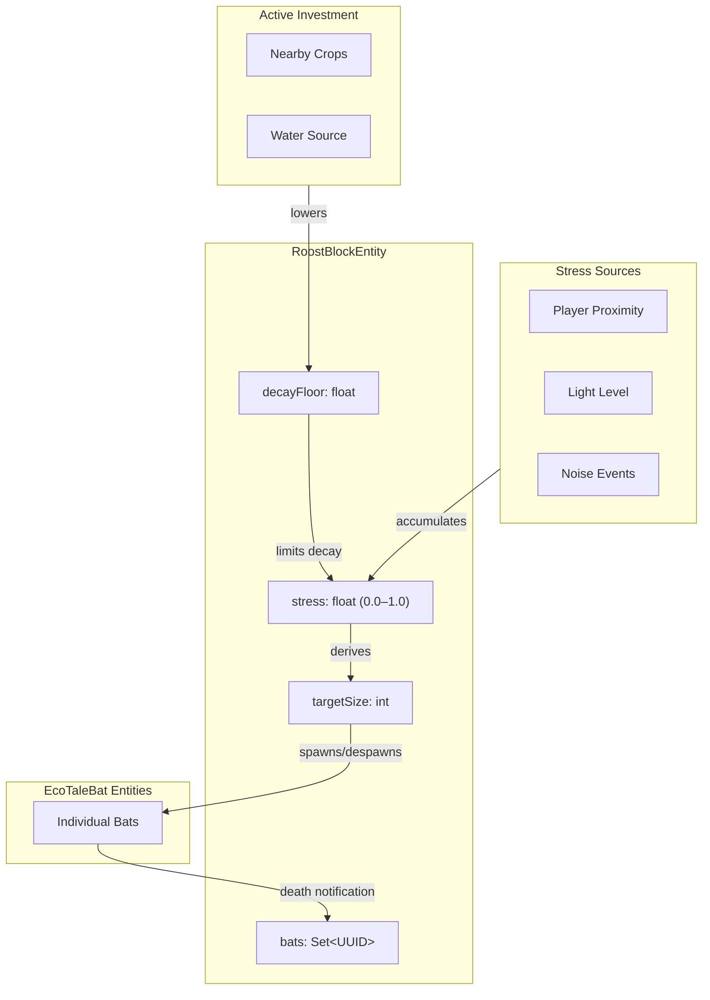

The Colony Health system manages bat population and stress for a single roost. It serves the Bats feature concept by providing the autonomous ecology that players observe and respond to.

A colony is defined by its roost block. One roost = one colony. The roost block acts as an anchor point; bats sleep on nearby surfaces within range, not necessarily on the block itself.

## System Diagram



## Subsystems

Colony Health decomposes into these subsystems, each requiring further specification:

| Subsystem             | What It Does                                          | Key Concerns                                            |
| --------------------- | ----------------------------------------------------- | ------------------------------------------------------- |
| Stress Accumulation   | Detects sources, accumulates stress, handles decay    | Detection ranges, accumulation rates, decay curve       |
| Investment Detection  | Scans for nearby crops and water, adjusts decay floor | Scan radius, what counts as "nearby," floor calculation |
| Population Management | Spawns and despawns bats based on target size         | Spawn timing, despawn selection, death notification     |

### Stress Accumulation

Responsible for detecting stress sources and managing the stress value over time.

**Must support:**
- Detecting players within range of the roost
- Detecting light levels at or near the roost
- Detecting noise events (explosions, pistons) within range
- Accumulating stress from active sources (clamped to 0.0–1.0)
- Decaying stress toward the decay floor when no sources are present
- Triggering stress increase when a bat dies

**Open parameters:** Detection radii, per-source stress contribution rates, decay rate, death stress amount.

### Investment Detection

Responsible for scanning the environment and adjusting the decay floor based on active investment.

**Must support:**
- Periodic scanning for crops within foraging range
- Periodic scanning for water sources within range
- Calculating decay floor based on detected investment
- Distinguishing between "no investment" (default floor) and "active investment" (lowered floor)

**Open parameters:** Scan radius, scan frequency, which blocks count as crops/water, floor calculation formula.

### Population Management

Responsible for keeping actual bat population aligned with target size.

**Must support:**
- Spawning bats when population is below target size
- Registering spawned bats in the colony's UUID set
- Despawning excess bats when population exceeds target size
- Receiving death notifications and removing dead bats from the UUID set
- Triggering stress increase on death (delegates to Stress Accumulation)

**Open parameters:** Spawn rate limiting, despawn selection criteria (oldest, furthest, random), death notification mechanism (bat callback vs Forge event).

## Component Responsibilities

### RoostBlockEntity

**Purpose:** Single source of truth for colony state—stress level and bat population.

**Owns:**

- `stress` — normalized float (0.0 = no stress, 1.0 = maximum stress)
- `decayFloor` — minimum stress level; lowered by active investment
- `bats` — set of UUIDs for tracked bat entities
- `targetSize` — derived from stress and MAX_ROOST_SIZE config

**Does:**

- Accumulates stress from detected sources (proximity, light, noise)
- Detects active investment (nearby crops, water) and adjusts decay floor accordingly
- Decays stress over time toward the decay floor
- Spawns bats when population is below target size
- Despawns excess bats when population exceeds target size (no Bat AI coordination required)
- Removes bat references when notified of death

**Does not:**

- Make decisions about individual bat behavior (that's Bat AI)
- Track where individual bats are sleeping (bats choose their own spots)

### Stress Sources

Stress sources are not a separate component—RoostBlockEntity detects them directly. Architecturally, there are three categories:

- **Proximity** — players within detection range
- **Light** — light level at or near the roost
- **Noise** — explosions, pistons, and other loud events

**Architectural constraint:** All sources feed into a single stress value. The system does not track stress types separately.

**Stress floor and decay:** Stress decays toward a floor value rather than zero. Without active investment, a colony can reach Calm but never Thriving—passive stewardship hits a ceiling. Active investment (food sources, habitat improvements) lowers the decay floor, enabling stress to reach the Thriving threshold. This creates meaningful distinction between "leave them alone" and "actively help them."

### Bat Boxes

Bat boxes are craftable roosts. Architecturally, they are the same as natural roosts — same RoostBlockEntity, same stress mechanics, same population tracking. The differences are configuration, not structure:

- **Reduced stress sensitivity** — player proximity contributes less stress
- **Lower maximum capacity** — smaller colonies than natural roosts
- **No worldgen placement** — players craft and place them

This means bat boxes trade peak output for stability. A natural roost with careful stewardship outproduces a bat box, but a bat box is more forgiving of player activity nearby.

### Population Tracking

Population tracking is internal to RoostBlockEntity, not a separate component. Key architectural decisions:

- **Individual tracking:** Colony tracks bats by UUID, not just a count. This enables accurate population queries and per-bat stress contribution on death.
- **Death notification:** Bats notify their home colony on death, OR a Forge event listener catches death and updates the colony. Polling is explicitly forbidden.
- **Death stress:** When a bat dies, stress increases proportionally to 1/MAX_ROOST_SIZE.

## Data Flow

### Stress Accumulation

```
RoostBlockEntity ticks
    → detects stress sources (players, light, noise events)
    → accumulates stress (clamped to 0.0–1.0)
    → stress decays when no sources present
    → targetSize recalculated from stress
```

### Population Adjustment

```
Population < targetSize:
    → spawn bat
    → register bat UUID in colony

Population > targetSize:
    → select bat for removal (oldest, furthest, or random — open parameter)
    → despawn bat directly (no flee behavior, no Bat AI involvement)
    → remove UUID from tracked set

Bat dies:
    → bat notifies colony OR event listener catches death
    → colony removes UUID from tracked set
    → stress increases by 1/MAX_ROOST_SIZE
```

## State Machine

Colony health manifests as discrete observable states, with transitions driven by stress thresholds.

| State     | Entry Condition                       | Exit Condition                                                      |
| --------- | ------------------------------------- | ------------------------------------------------------------------- |
| Thriving  | Stress falls below low threshold      | Stress rises above low threshold                                    |
| Calm      | Stress falls below moderate threshold | Stress rises above moderate threshold                               |
| Agitated  | Stress rises above moderate threshold | Stress falls below moderate threshold OR rises above high threshold |
| Disrupted | Stress rises above high threshold     | Stress falls below high threshold OR rises above critical threshold |
| Abandoned | Stress reaches critical threshold     | Stress decays below critical threshold (recovery)                   |

**Open parameters:** Threshold values for each state transition. This document establishes that states exist and transitions are threshold-driven; the exact values need specification.

**Primary indicator:** Bat count IS the observable health state. Players read colony health by counting bats. Each state corresponds to a target population range.

**Secondary indicators:** Bat AI may produce behavioral cues like squeaking or unusual activity patterns (e.g., bats awake during daytime) based on colony health state. These are flavor that reinforces the primary indicator, not separate signals to track. Particle effects are explicitly not used—visual noise without gameplay value.

**Recovery:** Abandoned is not terminal. When stress decays (no disturbance sources), the roost can recover and eventually spawn new bats.

## Key Decisions

| Decision            | Choice                        | Rationale                                                            |
| ------------------- | ----------------------------- | -------------------------------------------------------------------- |
| Colony definition   | Colony = roost (1:1)          | Simple mental model; avoids cluster detection complexity             |
| Stress model        | Single accumulating value     | Easier to reason about state transitions than multiple factors       |
| Population tracking | Individual UUIDs              | Enables accurate counts and per-bat stress on death                  |
| Death notification  | Bat notifies OR event         | No polling; either approach works architecturally                    |
| Observable health   | Bat count                     | More intuitive than particles/sounds; directly visible               |
| Roost as anchor     | Bats sleep nearby, not at     | Supports larger colonies without stacking bats on one block          |
| Culling mechanism   | Silent despawn                | Simple, no Bat AI coordination needed; population adjusts cleanly    |
| Bat boxes           | Same system, different config | Avoids duplicate architecture; differences are tuning, not structure |

## Integration Points

### Depends On

- **Block Registry** — RoostBlock must be registered
- **Entity Registry** — EcoTaleBat must be registered
- **Forge Event Bus** — for death notification (if using event approach)
- **Worldgen** — places roost blocks in caves

### Provides To

- **Bat AI System** — colony health state, home position
- **Guano System** — colony health determines guano production rate
- **Pollination System** — colony health determines pollination effectiveness
- **Mob Dampening System** — colony size determines territory protection

### Potential Conflicts

- **Chunk unloading** — bats may be in unloaded chunks while roost is loaded (or vice versa)
- **Other bat mods** — vanilla bat suppression must not break other mods' bats
- **Performance** — large colonies with many bats need efficient tick handling

## Open Questions

1. **Roost frequency vs. colony size** — Should worldgen place fewer large-capacity roosts or more small-capacity roosts? This affects performance control, visual clarity, and gameplay feel. Also determines whether colony spacing rules are needed — frequent small roosts naturally avoid overlap; infrequent large roosts may need enforced minimum distance. Needs POC investigation.

2. **Stress exposure interface** — What does Colony Health expose to downstream systems—the raw stress value, the discrete state, or both? This affects whether consumers (Guano, Pollination, Bat AI) can implement continuous scaling or only threshold-triggered behavior.
