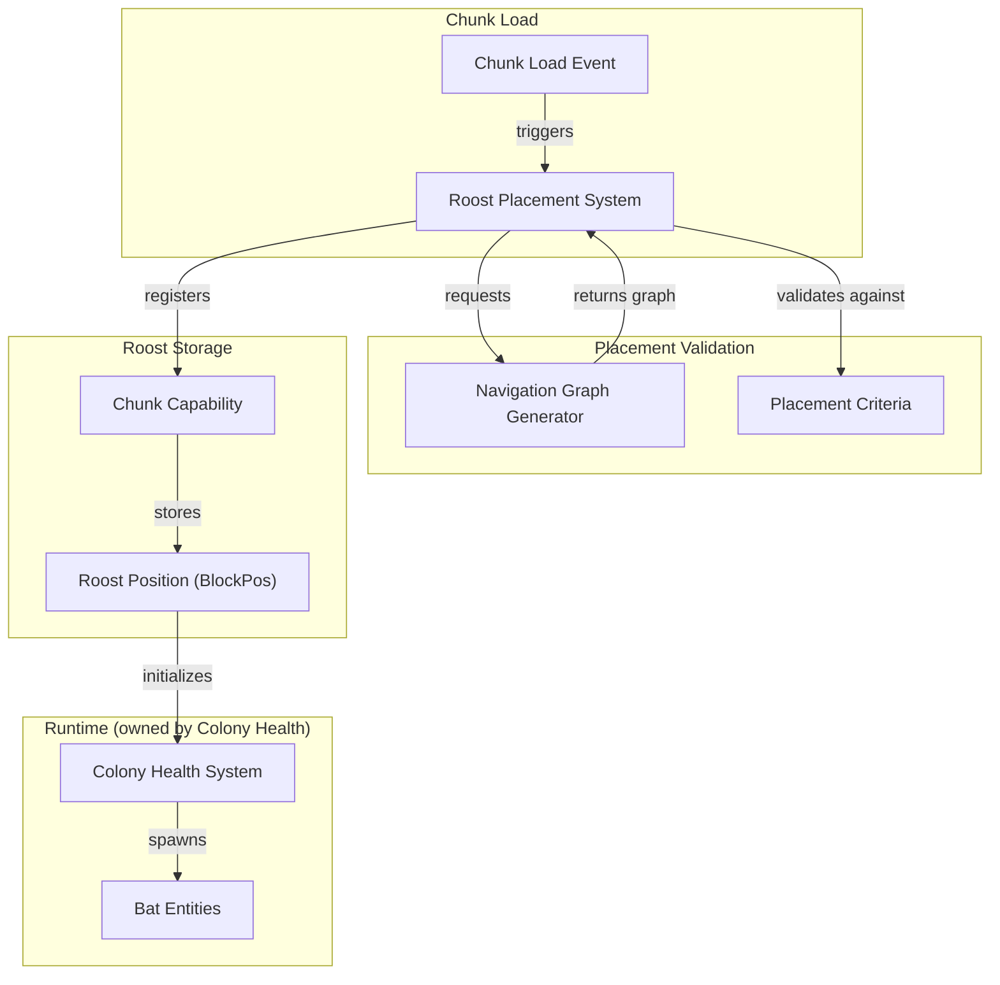

The Natural Roosts system places colony anchor points in caves when chunks load. It serves the Bats feature concept by ensuring players can discover bat colonies near their base without needing to craft bat boxes first.

This architecture owns placement decisions and roost storage. Runtime colony behavior belongs to Colony Health Architecture.

## Core Design Decision

Roosts are placed at **runtime during chunk load**, not during worldgen. This allows placement validation to use the full navigation graph system, ensuring every roost is actually habitable before bats spawn there.

Roosts are **coordinates, not blocks**. A roost is a `BlockPos` stored in a chunk capability that says "bats congregate here." The actual block at that position remains natural cave ceiling. No BlockEntity, no block replacement. The visual indicator of a roost is the bats themselves and accumulated guano.

## System Diagram



## Component Responsibilities

### Roost Placement System

**Purpose:** Identifies and registers valid roost locations when chunks load.

**Owns:**

- Candidate location identification
- Placement timing (on chunk load)
- Integration with chunk capability storage

**Does:**

- Listens for chunk load events
- Identifies candidate ceiling positions within the chunk
- Requests navigation graph generation for candidates
- Validates candidates against placement criteria
- Registers valid roosts in the chunk capability
- Triggers initial colony spawning via Colony Health

**Does not:**

- Own the navigation graph system (that's AI Behavior Architecture)
- Manage runtime colony behavior (that's Colony Health Architecture)

### Placement Criteria

**Purpose:** Validates whether a candidate position can support a bat colony.

**Owns:**

- The validation ruleset for roost locations

**Does:**

- Evaluates navigation graph connectivity (must reach sky within threshold)
- Evaluates graph size (must have minimum navigable space)
- Evaluates player distance (prevents visible "pop-in")

**Does not:**

- Generate navigation graphs (requests from existing system)
- Search for candidates (Placement System does that)

### Chunk Capability (Roost Storage)

**Purpose:** Persists roost locations within a chunk.

**Owns:**

- Zero or one roost position for the chunk
- Serialization/deserialization of roost data

**Does:**

- Stores roost positions as `BlockPos` coordinates
- Persists with chunk save/load
- Provides query interface for Colony Health

**Does not:**

- Validate positions (done at registration time)
- Manage colonies (Colony Health reads from this)

## Data Flow

### Roost Placement on Chunk Load

```
Chunk loads
    → Check if roost already exists within spacing range
    → If yes: skip placement entirely
    → Placement System activates
    → System identifies candidate ceiling positions
    → For each candidate:
        → Request navigation graph from candidate position
        → If graph generation fails: skip
        → Validate graph against criteria:
            → Must connect to sky within threshold
            → Must have minimum cell count
            → Must be far enough from active players
        → If validation fails: skip
        → Register roost position in chunk capability
        → Colony Health initializes colony at position
```

### Roost Persistence

```
Chunk saves
    → Chunk capability serializes roost positions
    → Positions saved as NBT data

Chunk loads (subsequent)
    → Chunk capability deserializes roost positions
    → Existing roosts restored (no re-validation needed)
    → Colony Health resumes colony management
```

## Validation Criteria

All validation uses the existing navigation graph system. This ensures "can bats live here" is answered by the same system bats use to navigate.

| Criterion | What It Checks | Why It Matters |
|-----------|----------------|----------------|
| Graph exists | Navigable air space from candidate | No graph = no navigation = uninhabitable |
| Sky connectivity | Graph reaches sky within maximum path length | Bats must be able to leave to forage |
| Minimum size | Graph has sufficient navigable cells | Colony needs room to exist |
| Player distance | Candidate is far enough from active players | Prevents visible roost "pop-in" |

Specific threshold values are determined via playtesting, not pinned at the architecture level.

### Emergent Biome Handling

No explicit biome restrictions are needed. The graph criteria handle problematic locations naturally:

- **Deep dark:** Fails because graphs won't connect to sky (too isolated)
- **Sealed pockets:** Fail minimum size or sky connectivity checks
- **Death traps:** Fail graph generation (no navigable space)

This is emergent behavior from the validation criteria, not a hardcoded blacklist.

## Key Decisions

| Decision | Choice | Rationale |
|----------|--------|-----------|
| Placement timing | Runtime (chunk load) | Enables graph-based validation; avoids worldgen complexity |
| Roost representation | Coordinate, not block | No BlockEntity overhead; ceiling can be mined without breaking roost concept |
| Validation approach | Navigation graph | Same system bats use; guarantees habitability |
| Biome restrictions | None (emergent) | Graph criteria naturally exclude problematic locations |
| Storage mechanism | Chunk capability | Persists with chunk; simple query interface |
| Candidate identification | Random sampling | Sample ceiling positions until one validates or candidates exhausted. Simpler than graph-first approach. |
| Placement density | At most 1 per chunk | Ceiling, not target. Spacing rules skip most chunks entirely if roost already exists within range. |
| Graph generation | Async via existing worker pool | Uses nav graph system's threading model. 5-second timeout. Nothing blocks main thread. |

## Integration Points

### Depends On

- **Navigation Graph System** — Graph generation for validation
- **Chunk Load Events** — Trigger for placement
- **Colony Health Architecture** — Colony initialization after placement
- **Ceiling Detection Utility** — Shared logic for identifying valid hanging positions (also used by bat AI for choosing sleep spots)

### Provides To

- **Colony Health Architecture** — Roost positions for colony management
- **Bat Boxes** — Same chunk capability registration path for player-placed roosts
